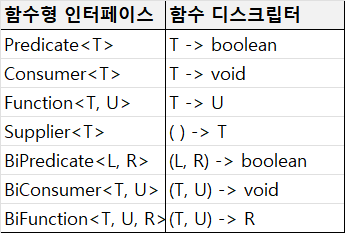

# 1. 리액티브 시스템과 리액티브 프로그래밍

## 리액티브 시스템의 정의
Reactive : 반응을 잘하는
Reactive System : 반응을 잘하는 시스템.
클라이언트의 요청에 즉각적으로 대응함으로써 지연 시간을 최소화.

## 리액티브 선언문(Reactive Manifesto) 설계 원칙

```빠른 응답성을 바탕으로 유지보수와 확장이 용이한 시스템```


(참고 : https://reactivemanifesto.org/)

Means : 수단. 리액티브 시스템의 주요 통신 수단으로, 비동기 메시지 기반의 통신 활용

Form :
- Elastic : 탄력성. 작업량 변화에 따라 탄력적으로 자원을 확대,축소할 수 있음. -> 응답성을 일정하게 유지
- Resilient : 회복성. 장애가 발생해도 응답성을 유지. 느슨한 결합, 격리성으로 장애가 발생해도 발생한 부분만 복구하면 되도록.

Value : 응답성. 리액티브 시스템의 핵심 가치.

## 리액티브 프로그래밍 개념
리액티브 시스템을 구축하는데 필요한 프로그래밍 모델
비동기 Non-Blocking 통신을 위한 프로그래밍 모델.

## 리액티브 프로그래밍의 특징
```
In computing, reactive programming is a 
declarative programming paradigm concerened with 
data streams and the propagation of change.
```

- declarative programming : 선언형.
- data streams : 데이터가 지속적으로 발생
- the propagation of change : 지속적으로 데이터가 발생할 때마다 이것을 변화하는 이벤트로 보고,
  이 이벤트를 발생시키면서 데이터를 계속적으로 전달

## 명령형 프로그래밍 vs 선언형 프로그래밍
선언형 프로그래밍은 동작을 구체적으로 명시하지 않고 목표만 선언.
코드가 간결해지고 가독성이 좋아짐.

## 리액티브 프로그래밍 코드 구성

- Publisher : 발행인, 발행자. 입력으로 들어오는 데이터를 제공하는 역할.
- Subscriber : 구독자. Publisher가 제공한 데이터를 전달받아서 사용하는 주체.
- Data Source : Publisher의 입력으로 들어오는 데이터. (= Data Stream)
- Operator : Publisher, Subscriber 사이에서 데이터를 가공. 데이터 생성, 필터링, 변환 등..


## Kafka와의 차이점
Kafka와 다르게 리액티브 스트림즈는 Publisher가 subscribe 메서드를 구현.
- Kafka는 Message Broker가 있지만 리액티브 스트림즈는 없음.

```java
public interface Publisher<T> {
    public void subscribe(Subscriber<? super T> s);
}
```
```java
public interface Subscriber<T> {
    public void onSubscribe(Subscription s);
    public void onNext(T t);
    public void onError(Throwable t);
    public void onComplete();
}
```
```java
public interface Subscription {
    public void request(long n);
    public void cancel();
}
```
** p.45 의 내용 다시 읽어보기
```java
public interface Processor<T, R> extends Subscriber<T>, Publisher<R> {
}
```

### 리액티브 스트림즈 용어 정의
- Signal : 신호. P와 S간에 주고받는 상호작용. (ex: onSubscribe, onNext, onComplete, onError, request, cancel,...)
- Demand : 데이터 요청
- Emit : 데이터 방출(제공)
- Upstream/Downstream : Flux로 구성된 메서드 체인 중 상하위 체인의 데이터
- Sequence : Publisher가 emit하는 데이터의 연속적인 흐름. 다양한 Operator로 데이터의 연속적인 흐름을 정의
- Operator : 연산자. just, filter, map같은 메서드를 지칭
- Source : (=Original) 최초에 생성된 무언가. 원본.

### 리액티브 스트림즈 구현 규칙
pass

### 리액티브 스트림즈 구현체
어떤 구현제를 사용하든 핵심 동작 원리는 같다.

** 사용상의 장단점을 googling하면 좋을거 같음
#### RxJava
- .NET 환경의 리액티브 확장 라이브러리를 넷플릭스에서 Java로 포팅. 
- 1.0 : Reactive Streams 사양 미지원.
- 2.0 : 리액티브 스트림즈 사양 지원. 때문에 2버전에서는 1.0과 2.0이 혼재. Java 9 지원.
- 3.0 : Reactive Streams 1.0.3 버전을 준수. 2버전에서 (최신 버전 3.1.8) 

### (Project) Reactor
- Spring Framework 팀 개발.
- 최신 버전 3.6.1. Spring Framework 5점대부터 지원.

### Akka Streams
- JVM상에서 동시성과 분산 어플리케이션을 단순화해 주는 오픈소스 툴킷
- Actor : Akka의 핵심. 
- Akka라는 Actor 기반의 동시성 모델을 사용하는 툴킷 위에 리액티브 스트림즈를 구현한 것이 Akka Streams

### Java Flow API
- Java 9부터 Flow API를 사용하여 리액티브 스트림즈 지원
- 다른 구현제들과의 차이점 : Java API에서 구현체가 아니라 SPI(Service Provider Interface)로만 정의되어 있음.

### 그 외 리액티브 Extension
- Android 플랫폼의 RxAndroid, Javascript의 RxJs, ...


# 3. Blocking I/O와 Non-Blocking I/O

## Blocking I/O
하나의 스레드가 I/O에 의해서 차단되어 대기하는 것

I/O 예시 : DB I/O, network I/O, File I/O

## 멀티스레딩 기법
Blocking I/O 방식의 문제점을 보완할 수 있는 방법. 그러나 이것도 단점이 존재

1. 컨텍스트 스위칭 (비용)
   1. 스레드가 여러 프로세스를 번갈아가며 실행할때 발생하는 비용으로, PCB라는 공간에 기존 프로세스 정보를 저장하고 새로운 프로세스 정보를 불러오는 과정
   2. 해당 시간동안에는 CPU가 다른 작업을 하지 못하며, 컨텍스트 스위칭이 많을수록 CPU의 전체 대기시간도 늘어나 성능이 저하됨
2. 과다한 메모리 사용
   1. 스레드가 늘어날 수록 스택 영역의 메모리 사용량이 비례하게 늘어남
   2. 64000명이 동시 접속 시, 64GB의 메모리가 필요
3. 스레드 풀 응답 지연 발생 가능성
   1. 대량의 요청이 들어오면 스레드 풀에서 사용 가능한 유휴 스레드가 없어 응답 지연이 발생할 수 있음

# Non-Blocking I/O


## Non-Blocking I/O
하나의 스레드가 I/O에 의해서 차단되지 않음.

장점
- 적은 수의 스레드만 사용해 스레드 전환 비용 낮음. CPU 효율적으로 사용.

단점
- CPU를 많이 사용하는 작업은 성능에 악영향을 줌
- 사용자의 요청에서 응답까지의 모든 과정에 하나라도 Blocking I/O 요소가 포함된 경우 Non-Blocking의 이점이 살아나지 않음.

## Spring WebFlux
spring framework 진영의 Non-Blocking I/O 구현체.  
- 과도한 클라이언트 트래픽에 대응할 수 있는 Spring MCV의 대안
- Netty 같은 비동기 기반 서버 엔진 사용

## Non-Blocking 통신이 적합한 시스템
1. 학습 난이도 (특히, Reactive Streams에 대한 이해)
2. 유지보수 고려
3. 대용량 트래픽이 발생하는 시스템
4. MSA 기반 시스템 (다른 서비스 호출이 많아 I/O구간 많으므로)

# 4. 리액티브 프로그래밍을 위한 사전 지식

## 함수형 인터페이스
- java 8부터 지원
- 함수를 값으로 취급할 수 있는 기능. 인터페이스에 단 하나의 추상 메서드만 정의되어 있음.

## 람다 표현식
- 익명 구현 객체를 간단하게 전달하는 방식.
- 함수형 인터페이스를 구현한 클래스의 인스턴스를 람다 표현식으로 작성해서 전달한다.

## 메서드 레퍼런스
`(Car car) -> car.getCarName()` == `Car::getCarName`

## 함수 디스크립터(Function Descriptor)
- 함수 설명자.
- 람다 표현식의 파라미터 개수와 타입, 리턴 타입을 보고 어떤 함수형 인터페이스인지 알고 싶을 때 확인용도.
- 라이브러리 내부를 뜯어볼때 유효함.
  - Predicate
  - Consumer
  - Function
  - Supplier
  - Bixxxx

