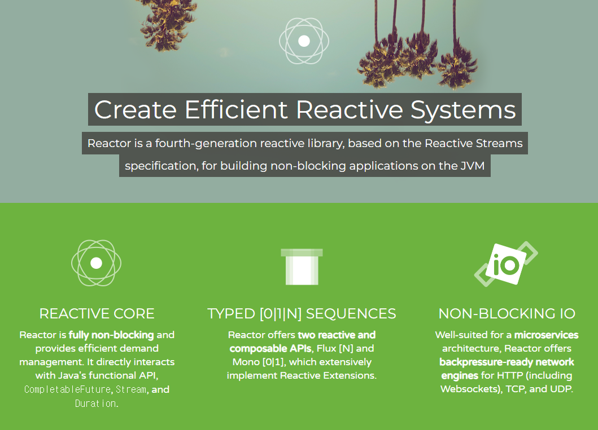
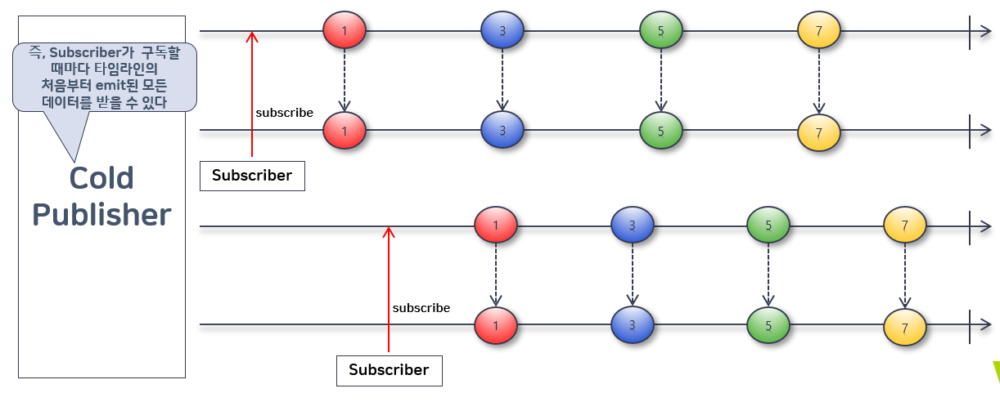
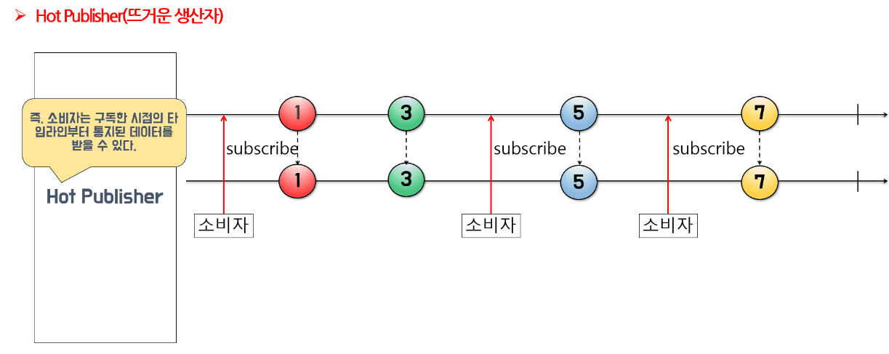
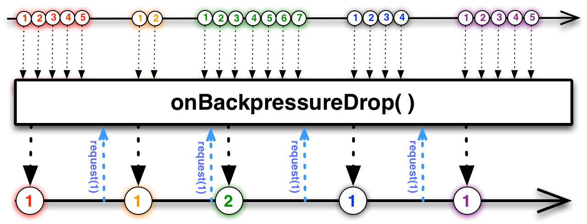
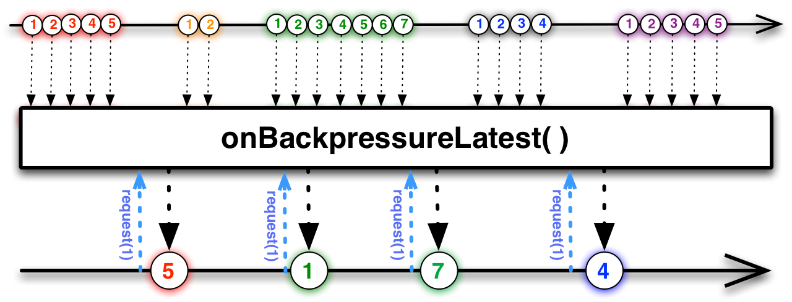
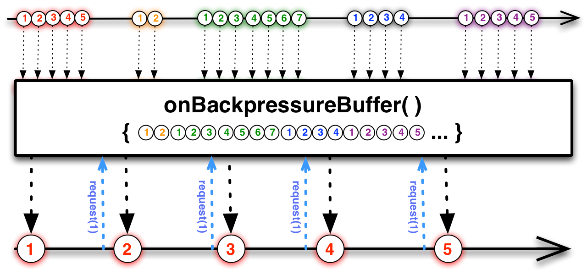

# 5. 리액터 개요



## 리액터의 단계
데이터를 생성해서 제공하고  
데이터를 가공하고  
전달받은 데이터를 처리한다

# 6. 마블 다이어그램

# 7.  Cold Sequence 와 Hot Sequence
Cold는 무언가를 새로 시작하고, Hot은 무언가를 새로 시작하지 않는다.

## Cold Sequence


## Hot Sequence


# 8. BackPressure
하단 이미지 출처  
https://blog.frankel.ch/backpressure-reactive-systems/

### Drop
buffer 밖에서 대기하는 먼저 emit된 데이터부터 drop 하는 전략


### Latest
buffer 밖에서 대기하는 가장 나중(최근)에 emit된 데이터부터 buffer에 채우는 전략


### Buffer
buffer 안에 있는 데이터부터 drop하는 전략



# 9.Sink

Sinks.One, Sinks.Many
Sinks.One은 Mono 의 의미구조(Semantics)를 가진다

```java
public final class Sinks {
    public static <T> Sinks.One<T> one() {
        return SinksSpecs.DEFAULT_ROOT_SPEC.one();
    }    
    public static ManySpec many() {
        return SinksSpecs.DEFAULT_ROOT_SPEC.many();
    }
    
    public interface ManySpec {
        UnicastSpec unicast();
        MulticaseSpec multicast();
        MulticaseReplaySpec replay();
    }
}
```
